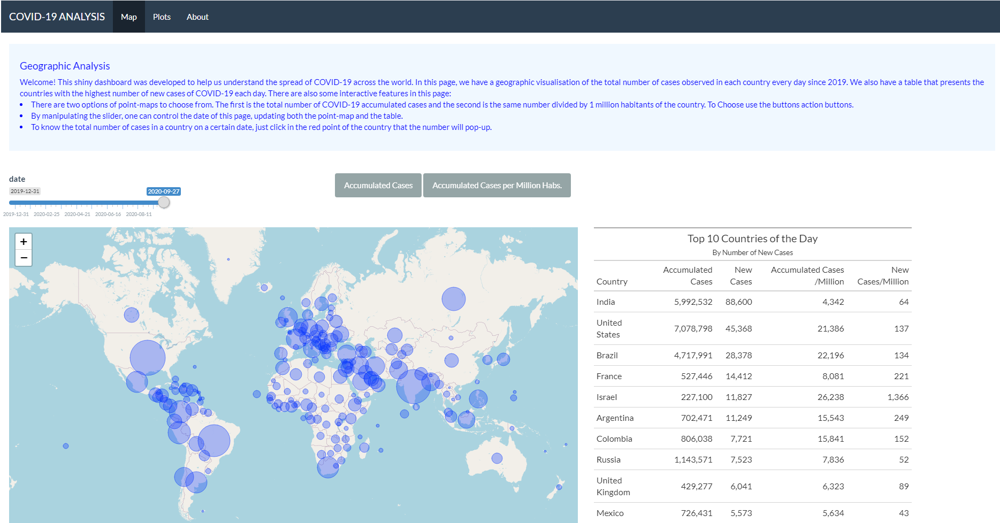

<br>
<br><br>
*Firts Page of the APP*

<br>

```{r setup,  echo=FALSE, include=FALSE}
knitr::opts_chunk$set(echo = TRUE)
```

Recently I have developed a Shiny APP to explore Covid-19 data for the unit *Communicating with Data - ETC5523* at Monash University. 
In this blog, post I will present the APP, explain the features and make a reflection on what I think could be improved. 

<br>

# Introducing the APP

The app was developed having a navbar and user may click in 2 webpages for interaction, and the last one is the about section. 
The main purpose of the app is to give the user the ability to observe the evolution of the pandemic throughout the year of 2020 
comparing numbers of all countries in the world. To do so, we use different tools such as maps, plots and tables. Multiple 
libraries were also used for data manipulation, visualization and formatting such as `dplyr`, `ggplot2`, `plotly`, `gt`, `leaflet` 
and much more. 

### Dataset

The dataset is a multivariate time-series that comprises multiple features from the period of the 31th of December, 2019 to the 27th of semptember of 2020. It has multiple variables of every country. Some directly related to the Covid-19 such as the total number of deaths, total number of deaths per million habitats number of tests per day and positive rate of tests. Others relate to social and economic variables that were not explored in this project. The dataset was sourced from the website [Our World in Data](https://ourworldindata.org/coronavirus/country/bolivia?country=~BOL). The website is from the organization with the same name, based on Oxford University.


### Page 1 - Dot Density Map and Table

On the top of the page, instructions can be found on how to operate and interact with the features. Scrolling down, there is a world dot-density map and an interactive table. These features are connected to input objects from Shiny in the following manner:
- An slider input chooses the day of the year that will be exposed both in the dot-density map and the table. 
- Action buttons are used to select what variable will be presented in the dot-density map. 
The dot density map was created with `leaflet` and represents the most affected countries by the pandemic. The size of the dots is proportional to the variable chosen in the action button, which can be either *Accumulated Number of Cases* or *Accumulated Number of Cases per Million Habitants*. <br>
In the table next to the map-plot, the user will know the top-10 countries with more *new cases* in the particular chosen day in the sliderinput. Other variables that are also observed are *new cases per 1 per Million Habitants*, *Accumulated Number of Cases* and *Accumulated Number of Cases per Million Habitants*


### Page 2 - Barplots with Plotly

In the second page we can analyze the evolution of a range of eight variables such as `total deaths`, `total cases` and more related to COVID-19. Stacked barplots were used where each of the bars refers to a country. When opening this webpage the plotted countries are the US, India and Brazil, 3 of the most affected countries by the pandemic. The user can modify the composition of the plots with the select box and choose as many countries as he wants. To analyze a unique day of a country it is possible to hover over or click in the bar. When clicking it should color in blue the country. The plots were made with plotly. 

<br>

#  Self Review

Now we will make a critical analysis of the shiny app, focusing on answering the proposed questions that will inspire ourselves to further improve this project. To start our analysis we will explore the positive points of the APP. 

### What did you do well?

We believe the app has fulfilled it's goal to present for the user a good-looking and explanatory visual comparison of the evolution of COVID-19 across all countries. In the initial page we have made use of a dot-density map plot with the package `leaflet`, that was able to transmit very rapidly for the user which countries were the most affected by the pandemic and which had a more soft experience. To add to our visualization we inserted the option of visualizing the numbers either in absolute or relative numbers (divided per 1 million habbitants).

I consider that the slider input to choose the date was also a happy choice for this page (instead of a inputbox). By sliding the pointer the user could see clear trends of growth of covid numbers in each country. Also, the slider was integrated with the table that presented the most affected countries by Covid-19 in a particular date. If one pays attention to the table when sliding the pointer he will see which countries were having more cases according to the moment of the year.

The second page also offered good comparative visualizations of multiple countries, but this time using stacked barplots. The dimensions of the plots were carefully chosen so that the page could fit all the eight plots in the page giving the user the opportunity to analyze multiple variables at the same time. Having stacked barplots instead of side-by-side plots allowed the user to choose many countries and have a clear notion of the dimensions in the data.


### What are the points you can improve on?

Given limitations on time, I believe there are some points of improvement that could enhance the App. 
A problem was observed in particular with legend of plots in the second page. Unfortunately the legend was poorly placed under the last plot in the right side, and as a consequence this plot was resided to fit the legends every time the user updated the analyzed countries. At the same time, all other plots would remain with the same size making the page less proportional. 

Other things that could improve relate to the design of the app. Maybe the app would look better if there was only one page instead of the 3 observed in the navbar. Having instructions in the top of the page was also possibly not the best visual option, and it could be brought to a sidebar panel on the left. 


### What are some things that you’d like to add that’s plausible?

There are endless possible features that can added to improve this app, we will list a few that we consider feasible with not too much work. 

1. Making the sliderinput animated with a bottom, which requires proper management of the animation speed. This is necessary because there are more than 250 days of COVID-pandemic, so the slider shouldn't stop at every day to show the numbers. 
2. Add more action buttons to show different variables in the dot density map such as `tests per case`, `positive rate` and `tests units`, all of each available in the covid dataset. 
3. Adding a new page with in-depth statistical analysis to find insights on patterns of spread of covid-19.
4. A new page dedicated to forecasting of the numbers in the next 30 days by country using models such ARIMA.    


### What are some things that you’d like to add that cannot be done yet due to limitation in data or technology?

The biggest struggle faced in this work was regarding the speed it takes for an update in plotly. After tirelessly researching about the topic 
I am convinced that there is a limitation in technology that does not allow my second page which has 8 plots using plotly to update in less than 3-4 seconds. Similarly, I would like the leaflet plot to be faster, although it is not as slow as the plotly plots.
The app could also be improved if we had regional data available, which means by city, or state (not only by country). Some countries as the United States and Brazil are big and it would be better to show where are the hotspots instead of aggregate numbers.

<br>

# Conclusion

Given imposed time constraints we believe our app has successfully accomplished its mission, and it is now a valuable piece of visualization and analysis to be added in a future to my portfolio. It allows user to have a clear picture of the world situation of COVID-19 in a few seconds thanks to 
the leaftlet map and it offers tools to compare the countries such as stacked barplots.
However, some tasks could enhance this project, such as making animated visualizations with the map and using more data with more granularity.
